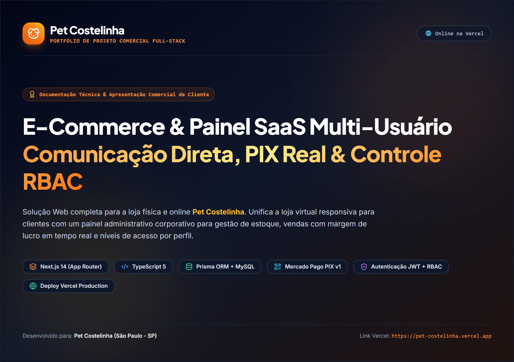
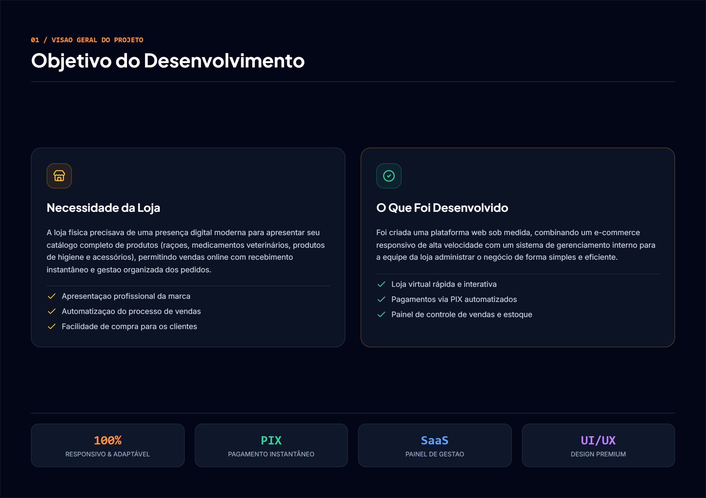
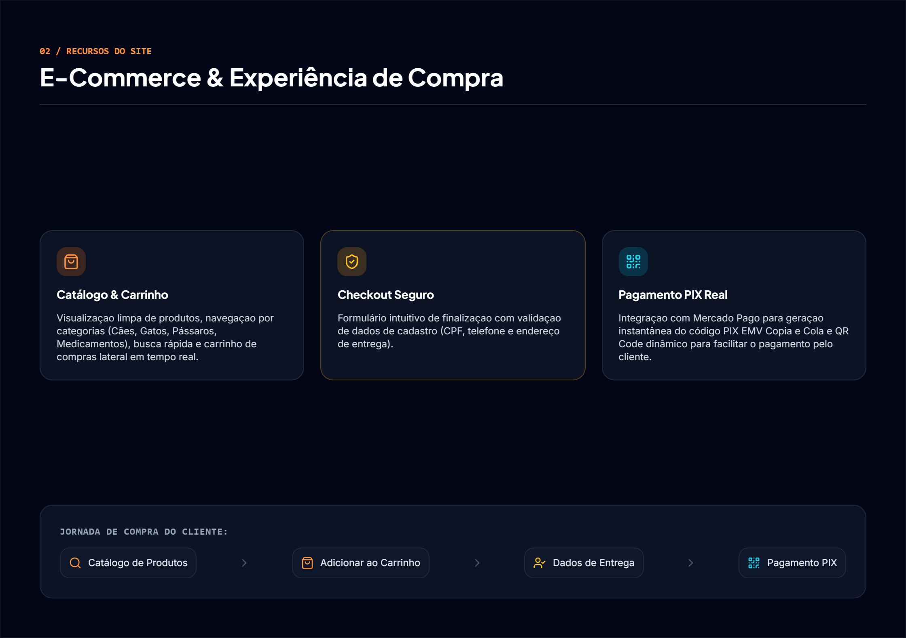
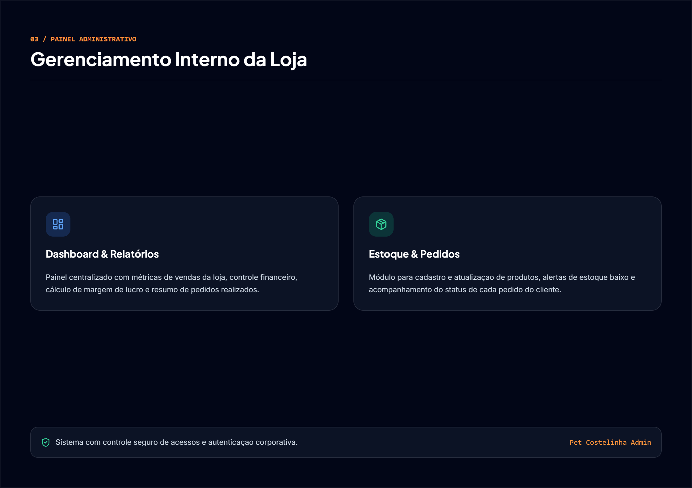
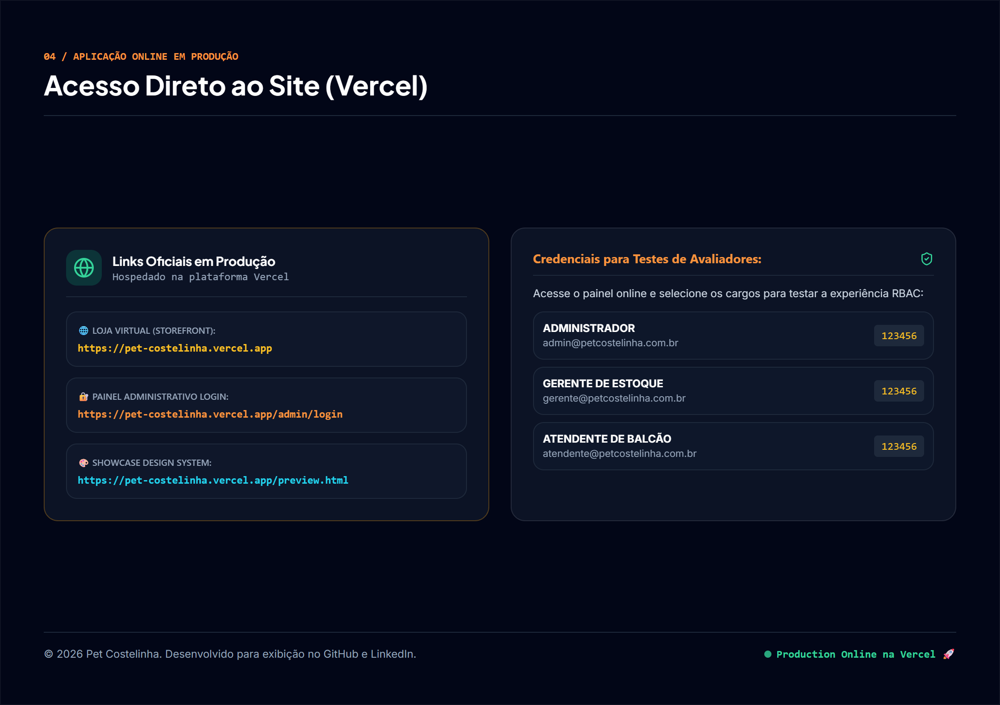

# 🐾 Pet Costelinha - E-Commerce Full-Stack & Painel SaaS Multi-Usuário (RBAC)


> **Projeto Comercial Desenvolvido para Cliente & Portfolio Showcase (GitHub / LinkedIn)**  
> Plataforma Web Full-Stack para a loja física comercial **Pet Costelinha**, integrando uma **Storefront Virtual e-commerce** com catálogo em tempo real e checkout PIX automatizado a um **Painel Administrativo SaaS Corporativo** com Controle de Acesso Baseado em Cargos (RBAC) e relatórios financeiros de margem de lucro.

---

## 🌐 Acesse a Aplicação Online (Vercel Production)

O sistema está publicado e operante na nuvem:

- 🛍️ **Loja Virtual (Storefront)**: [https://pet-costelinha.vercel.app](https://pet-costelinha.vercel.app)
- 🔐 **Painel Administrativo Login**: [https://pet-costelinha.vercel.app/admin/login](https://pet-costelinha.vercel.app/admin/login)
- 🎨 **Preview Interativo UI/UX**: [https://pet-costelinha.vercel.app/preview.html](https://pet-costelinha.vercel.app/preview.html)

---

## 📄 Case Study em PDF & Apresentação Visual

Este projeto acompanha uma documentação comercial e técnica no formato de **Case Study em PDF**, criada com padrões internacionais de **UI/UX Pro Max** para apresentação executiva, recrutadores e redes profissionais (LinkedIn/GitHub).

👉 **[📄 Baixar Documentação Completa em PDF (Pet_Costelinha_Documentacao_Case_Study.pdf)](./Pet_Costelinha_Documentacao_Case_Study.pdf)**

### 🖼️ Preview das Páginas do Documento PDF

<div align="center">

#### 1. Capa Executiva do Case Study


#### 2. Contexto de Negócio & Desafios Resolvidos


#### 3. Storefront E-Commerce & Checkout PIX Automático


#### 4. Painel Administrativo SaaS & Matriz de Permissões RBAC


#### 5. Acesso Online em Produção na Vercel


</div>

---

## 🎯 Por Que e Para Que o Projeto Foi Desenvolvido?

### 💡 O Motivo do Desenvolvimento
A loja física **Pet Costelinha** (localizada no Jardim das Oliveiras - São Paulo/SP) atendia seus clientes de bairro de maneira informal via mensagens no WhatsApp e anotações manuais. Esse modelo trazia limitações operacionais:
1. **Falta de visibilidade do catálogo**: Dificuldade em apresentar a variedade de rações (Magnus, Special Dog), medicamentos veterinários e acessórios.
2. **Cálculo impreciso da margem de lucro**: Vendas sem controle do custo de aquisição versus preço de venda.
3. **Riscos no cadastro de clientes**: Dados incompletos ou CPFs falsos em compras a prazo ou entregas.
4. **Sem gestão de funções da equipe**: Atendentes, gerentes e proprietários compartilhavam o mesmo controle informal de caixa.

### 🚀 A Solução Entregue
O sistema foi desenvolvido em **Março de 2026** como uma solução full-stack sob medida para digitalizar e automatizar 100% das operações da loja:
- **E-Commerce Responsivo**: Vitrine interativa com busca em tempo real, filtros por espécies/categorias e drawer de carrinho lateral.
- **Checkout com Validador Real de CPF**: Algoritmo que checa dígitos verificadores do CPF em tempo real antes de liberar a compra.
- **Pagamento Instantâneo via PIX (Mercado Pago API v1)**: Geração de QR Code e código PIX EMV Copia e Cola com escuta via Webhook.
- **Painel SaaS Corporativo Multi-Usuário (RBAC)**: Autenticação JWT com permissões granulares (`ADMIN`, `GERENTE`, `ATENDENTE`, `CLIENTE`).
- **Dashboard Financeiro Inteligente**: Métricas de receita bruta e cálculo em tempo real do **Lucro Bruto Estimado** `(Preço Venda - Preço Custo) * Qtd`.

---

## ✨ Funcionalidades Principais

### 🛍️ Storefront (Visão do Cliente)
- **Catálogo com Produtos e Preços Reais**: Produtos das marcas Magnus, Special Dog, Golden, medicamentos como Simparic, areias higiênicas e gaiolas de madeira com preços médios reais do mercado brasileiro.
- **Carrossel de Categorias**: Filtros rápidos por *Cães*, *Gatos*, *Aves & Gaiolas*, *Higiene & Cuidados* e *Acessórios*.
- **Modal de Detalhes do Produto**: Visualização detalhada com especificações técnicas, seletor de quantidade e selos de qualidade.
- **Carrinho Deslizante (Slide-Over)**: Drawer lateral responsivo com atualização em tempo real de itens e subtotal.
- **Checkout Seguro com Máscara e Validação**: Algoritmo de validação de CPF (`000.000.000-00`), telefone `(00) 00000-0000` e CEP.
- **Integração PIX Mercado Pago**: Copia e Cola instantâneo e QR Code dinâmico gerado em menos de 3 segundos.

### 🛡️ Painel Administrativo SaaS Multi-Usuário (RBAC)
- **Autenticação com JWT & bcryptjs**: Sessões seguras gravadas em Cookies HttpOnly com proteção contra CSRF.
- **Dashboard Financeiro**: Exibição de Receita Total, Lucro Bruto da Loja, Total de Pedidos Realizados e Ticket Médio.
- **Gestão de Pedidos**: Filtros por CPF, nome do cliente e código do pedido, com alteração de status (`PENDING`, `PAID`, `PROCESSING`, `DELIVERED`, `CANCELLED`).
- **Gestão de Estoque**: Cadastro, edição de produtos e alertas visuais automáticos de **Estoque Baixo** (<= 5 unidades).
- **Gestão de Equipe**: Cadastro de colaboradores com atribuição de cargo e redefinição de senhas.
- **Configurações Globais da Loja (`/admin/settings`)**: Edição em tempo real do Nome Comercial, Slogan, Telefone, WhatsApp, E-mail, CNPJ e Chave PIX oficial da loja.

---

## 🔐 Matriz de Permissões RBAC & Credenciais de Teste

No painel de login online ([https://pet-costelinha.vercel.app/admin/login](https://pet-costelinha.vercel.app/admin/login)), você pode utilizar as seguintes contas para testar a experiência de cada cargo:

| Cargo | E-mail | Senha | Permissão Principal |
| :--- | :--- | :--- | :--- |
| **ADMIN** | `admin@petcostelinha.com.br` | `123456` | Acesso Total, Lucro Bruto, Equipe e Configurações |
| **GERENTE** | `gerente@petcostelinha.com.br` | `123456` | Gestão de Estoque e Edição de Produtos |
| **ATENDENTE** | `atendente@petcostelinha.com.br` | `123456` | Separação de Pedidos de Balcão e Status |

### Tabela Detalhada de Acessos:

| Módulo / Recurso | ADMIN | GERENTE | ATENDENTE | CLIENTE |
| :--- | :---: | :---: | :---: | :---: |
| **Dashboard Financeiro & Lucro Bruto** | ✅ SIM | ❌ NÃO | ❌ NÃO | ❌ NÃO |
| **Gestão de Usuários / Equipe** | ✅ SIM | ❌ NÃO | ❌ NÃO | ❌ NÃO |
| **Configurações da Loja (CNPJ, Chave PIX)** | ✅ SIM | ❌ NÃO | ❌ NÃO | ❌ NÃO |
| **Cadastro & Edição de Produtos / Estoque** | ✅ SIM | ✅ SIM | 👁️ Consulta | ❌ NÃO |
| **Atualização de Status de Pedidos** | ✅ SIM | ✅ SIM | ✅ Separação | ❌ NÃO |
| **Realizar Compras via PIX / WhatsApp** | ✅ SIM | ✅ SIM | ✅ SIM | ✅ SIM |

---

## 🛠️ Tecnologias & Design System

### Stack Tecnológico
- **Hospedagem & Deploy**: [Vercel Production](https://vercel.com/)
- **Framework Frontend & Backend**: [Next.js 14 (App Router)](https://nextjs.org/)
- **Linguagem**: [TypeScript 5](https://www.typescriptlang.org/)
- **Estilização**: [TailwindCSS 3.4](https://tailwindcss.com/) + [Lucide Icons](https://lucide.dev/)
- **ORM & Banco de Dados**: [Prisma ORM 5](https://www.prisma.io/) com [MySQL 8.0](https://www.mysql.com/)
- **Autenticação & Segurança**: JWT (`jsonwebtoken`), `bcryptjs`, Cookies HttpOnly
- **Integração de Pagamento**: Mercado Pago Payment API v1 (PIX & Webhook)
- **Envio de E-mails**: [Nodemailer](https://nodemailer.com/) (SMTP)
- **Geração de PDF Case Study**: Puppeteer + HTML5/CSS3 Canvas

---

## 📁 Estrutura de Pastas do Repositório

```
pet-costelinha/
├── docs/
│   └── screenshots/         # Imagens PNG de alta resolução extraídas do PDF Case Study
├── prisma/
│   ├── schema.prisma        # Schemas do banco (User, Address, Pet, Product, Category, Order, StoreSetting)
│   └── seed.ts              # Seeding com produtos reais, preços de mercado e usuários RBAC
├── public/                  # Favicon, logos e marcas d'água
├── scripts/
│   ├── generate-case-study.js # Script Puppeteer para compilação do PDF e PNGs de apresentação
│   └── test-mercadopago-pix.js # Testes de integração da API do Mercado Pago
├── src/
│   ├── app/
│   │   ├── admin/           # Telas do Painel Admin SaaS (Dashboard, Pedidos, Produtos, Usuários, Settings)
│   │   ├── api/             # Endpoints REST (Auth, Products, Orders, Users, StoreSettings, Webhooks)
│   │   ├── globals.css      # Estilos Tailwind CSS e utilitários de animação
│   │   └── page.tsx         # Storefront Homepage da Loja Virtual
│   ├── components/
│   │   ├── AdminLayout.tsx  # Layout Sidebar SaaS do Admin
│   │   ├── CartDrawer.tsx   # Drawer de Carrinho Lateral
│   │   ├── CheckoutModal.tsx # Modal de Checkout com CPF e PIX Mercado Pago
│   │   ├── Header.tsx       # Navegação Superior Comercial
│   │   ├── ProductCard.tsx  # Card de Exibição de Produtos
│   │   └── ProductDetailsModal.tsx # Modal com Especificações do Produto
│   └── lib/
│       ├── auth.ts          # Verificação de Tokens JWT e Cookies
│       ├── masks.ts         # Algoritmo de Validação de CPF, Telefone e Moeda (BRL)
│       └── prisma.ts        # Instância Global do Prisma Client
├── Pet_Costelinha_Documentacao_Case_Study.pdf # PDF de Apresentação Executiva
├── package.json
└── README.md
```

---

## 👨‍💻 Autor & Direitos

Projeto desenvolvido como **Case Study e Projeto Comercial para Cliente** por Davi.  
Compartilhado para fins de portfólio no **GitHub** e **LinkedIn**.

- **Site Oficial em Produção**: [https://pet-costelinha.vercel.app](https://pet-costelinha.vercel.app)
- **Repositório GitHub**: [github.com/davizinhoofiap/pet-costelinha](https://github.com/davizinhoofiap/pet-costelinha)
- **Licença**: Todos os direitos da marca reservados à **Pet Costelinha**.
